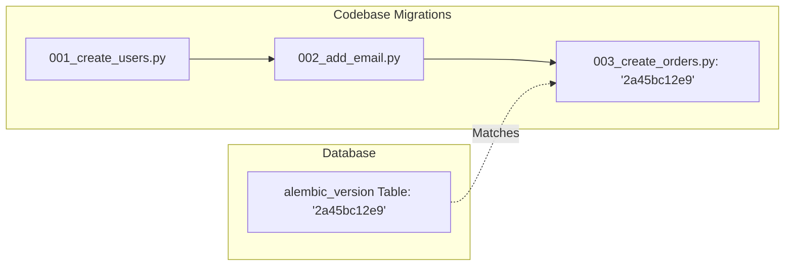

# Database Migrations

In professional software development, databases are not static. As applications evolve, schemas change: new tables are created, columns are added or deleted, and constraints are updated. 

This guide details how database migrations manage these changes safely across environments.

---

## 1. Why Database Migrations Matter

Without a migration tool, database schema changes are managed manually (e.g., executing raw SQL scripts directly in databases). This leads to:
- **Inconsistencies**: A developer's local schema differs from staging or production.
- **Drift**: Schema changes get forgotten during releases, breaking the app.
- **Risk**: Deleting or changing columns without data backup can lead to irreversible data loss.

Database migrations act as **version control for your database schema**, tracking incremental changes in sequential files stored in the codebase.

---

## 2. Schema Versioning

Migration tools maintain a special table (often named `alembic_version` or `schema_version`) containing a single row representing the current schema version hash.



When a new version is created, the migration script updates the database schema *and* increments the version hash in the tracking table.

---

## 3. Migration Tools Landscape

Depending on your programming language and framework, different tools exist:

| Language/Framework | Tool | Description |
|---|---|---|
| **Python / SQLAlchemy** | **Alembic** | Standard tool for SQLAlchemy. Can auto-generate migrations by comparing ORM models with database schemas. |
| **Python / Django** | **Django Migrations** | Built-in migration framework for Django models. |
| **Java** | **Flyway** / **Liquibase** | SQL-based or XML/YAML-based schema managers. |
| **Node.js** | **Knex.js** / **TypeORM** | Migration libraries for Javascript/Typescript. |
| **Go** | **golang-migrate** | Simple CLI tool using raw SQL migration files. |

---

## 4. Structure: Forward (Up) vs. Rollback (Down)

Every migration script consists of two main functions:

1. **`upgrade()` (or `up`)**: The SQL/commands required to transition the database schema to the *next* version.
2. **`downgrade()` (or `down`)**: The SQL/commands required to *revert* the changes made in the upgrade, taking the schema back to the *previous* version.

### Conceptual Alembic Example
```python
# Revision ID: 2a45bc12e9
# Down Revision ID: 8c34fe7321

from alembic import op
import sqlalchemy as sa

def upgrade():
    # Forward: add email column
    op.add_column('users', sa.Column('email', sa.String(100), nullable=True))

def downgrade():
    # Rollback: remove email column
    op.drop_column('users', 'email')
```

---

## 5. Zero-Downtime Migration Best Practices

Deploying migrations to high-traffic production environments requires caution.

### Avoid Table Locks
In many databases, altering a table to add a column with a default value or making a column `NOT NULL` locks the entire table for the duration of the scan, making it unavailable to users.
- *Best practice*: Add columns as nullable first, populate data in batches, then apply constraints.

### Expand-Contract Pattern for Rename/Delete
Never delete or rename a column in a single deploy if active applications are running, as the code still expects the old column.
- **Phase 1 (Expand)**: Add the new column (keep the old column). Update code to write to both columns.
- **Phase 2 (Backfill)**: Backfill historical data from the old column to the new column.
- **Phase 3 (Contract)**: Update code to read/write only from the new column.
- **Phase 4 (Cleanup)**: Drop the old column in a final migration.

### Keep Migrations Reversible
Always write a matching `downgrade` function. If you drop a table or column in `upgrade`, remember that a rollback will require rebuilding it (which might result in data loss if backups are not made first).
