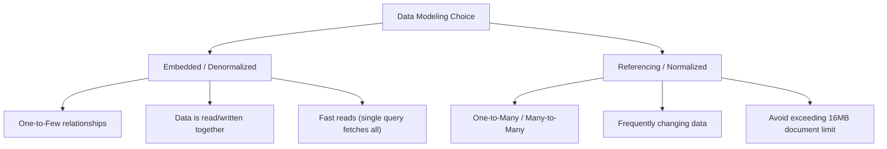

# Schema Design: Relational vs. Document Databases

Designing a clean, efficient database schema requires understanding the underlying data model, access patterns, and tradeoffs between relational (SQL) and document (NoSQL) databases.

---

## 1. Relational Database Normalization

Normalization is the systematic process of organizing database fields to reduce data redundancy and eliminate anomalies (Insertion, Update, and Deletion anomalies).

### Normal Forms (1NF, 2NF, 3NF)

#### First Normal Form (1NF)
- **Rules**:
  1. Each column must contain atomic (indivisible) values.
  2. Each record (row) must be unique.
  3. No repeating groups of columns.
- **Example Violation**: Storing `hobbies: "reading, hiking, coding"` in a single column.
- **Resolution**: Break hobbies into separate rows or a junction table.

#### Second Normal Form (2NF)
- **Rules**:
  1. Must be in 1NF.
  2. All non-key attributes must be fully functional dependent on the primary key (no partial dependencies on a composite primary key).
- **Example Violation**: In a table `ProjectAssignments(EmployeeID, ProjectID, EmployeeName, ProjectName)`, the primary key is `(EmployeeID, ProjectID)`. `EmployeeName` only depends on `EmployeeID` (part of the key), which violates 2NF.
- **Resolution**: Split into separate tables: `Employees(EmployeeID, EmployeeName)`, `Projects(ProjectID, ProjectName)`, and `Assignments(EmployeeID, ProjectID)`.

#### Third Normal Form (3NF)
- **Rules**:
  1. Must be in 2NF.
  2. No transitive dependencies (non-key columns cannot depend on other non-key columns).
- **Example Violation**: In a table `Employees(EmployeeID, Name, DepartmentID, DepartmentName)`, `DepartmentName` depends on `DepartmentID`, which depends on `EmployeeID`. Since `DepartmentID` is not a candidate key, this is a transitive dependency.
- **Resolution**: Move department details to a separate table `Departments(DepartmentID, DepartmentName)`.

---

## 2. Denormalization

Denormalization is the process of intentionally introducing redundancy into a database schema to optimize read performance. 
- **Pros**: Reduces complex joins, speeds up reads, simplifies queries.
- **Cons**: Increases storage requirements, makes write operations slower and more complex (requires updating redundant data in multiple places), risks data inconsistency.
- **Use Case**: Read-heavy analytical workloads or reporting dashboards where write lag is acceptable.

---

## 3. Relational Constraints

SQL databases rely on strict validation constraints to guarantee data integrity.

| Constraint | Description | Example |
|---|---|---|
| **Primary Key (PK)** | Uniquely identifies each row in a table. Cannot be NULL. | `id SERIAL PRIMARY KEY` |
| **Foreign Key (FK)** | Establishes a link between tables, enforcing referential integrity. | `FOREIGN KEY (dept_id) REFERENCES departments(id)` |
| **Unique** | Ensures all values in a column are distinct. | `email VARCHAR(100) UNIQUE` |
| **Not Null** | Prevens null values from being inserted. | `username VARCHAR(50) NOT NULL` |
| **Check** | Validates that all values in a column satisfy a boolean expression. | `CHECK (age >= 18)` |

---

## 4. MongoDB Document Modeling

Unlike relational tables, MongoDB stores data in dynamic, flexible BSON (Binary JSON) documents. Document modeling centers around **Access Patterns** (how the application queries the data).

### Embedding vs. Referencing



#### Embedded Documents (Denormalized)
Store related data inside a single document.
- **Example**: Storing address history inside a `user` document:
  ```json
  {
    "_id": 1,
    "name": "Alex",
    "addresses": [
      { "street": "123 Main St", "city": "Seattle" },
      { "street": "456 Pine Rd", "city": "Portland" }
    ]
  }
  ```
- **When to use**: One-to-few relationships, data that is mostly static and read together.

#### References (Normalized)
Store data in separate collections and link them using reference IDs.
- **Example**: Linking orders to a user collection:
  ```json
  // users collection
  { "_id": ObjectId("60c72b2f..."), "name": "Alex" }
  
  // orders collection
  { "_id": 1001, "user_id": ObjectId("60c72b2f..."), "total": 45.99 }
  ```
- **When to use**: One-to-many or many-to-many relations, when data changes frequently, or to prevent documents from growing beyond the **16MB size limit**.

---

## 5. Schema Design Best Practices

1. **Prioritize Query Patterns**: In NoSQL, design schemas based on how you read the data. In SQL, design for data organization first, then tune with views, indexes, or partial denormalization.
2. **Avoid Oversized Arrays**: In MongoDB, unbounded arrays (e.g., adding every user comment into a single post document) will eventually crash the application as the document hits the 16MB size limit.
3. **Use Appropriate Primary Keys**: Prefer auto-incrementing serial values or UUIDs depending on database distribution. For MongoDB, the default `_id` (ObjectId) provides timestamp sorting and high uniqueness out-of-the-box.
4. **Define Indexes Early**: Design your fields keeping in mind which ones will be sorted, filtered, or joined.
