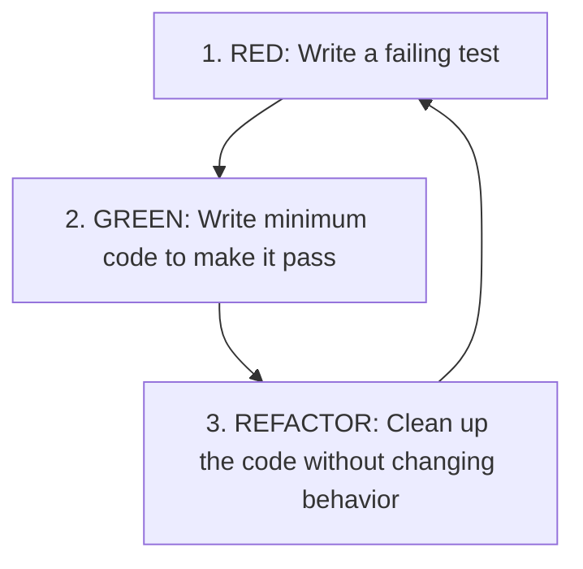

# Test-Driven Development (TDD)

Test-Driven Development (TDD) is a software development process where you write automated tests *before* writing the actual production code.

---

## 1. The Red-Green-Refactor Cycle

The core workflow of TDD is a rapid, repeating 3-step cycle:



1. **RED**: Write a small, focused test that defines a new function or feature. Run the test suite and watch it fail (usually because the function doesn't exist yet or doesn't have the logic).
2. **GREEN**: Write the simplest, quickest code possible to make the test pass. Do not worry about clean architecture or performance at this step; focus on correctness.
3. **REFACTOR**: Clean up both the production code and the test code. Remove duplication, improve variable names, organize methods, and simplify logic. Ensure the tests stay green.

---

## 2. Uncle Bob's Three Laws of TDD

1. You are not allowed to write any production code unless it is to make a failing unit test pass.
2. You are not allowed to write any more of a unit test than is sufficient to fail; and compilation failures are failures.
3. You are not allowed to write any more production code than is sufficient to pass the one failing unit test.

---

## 3. Practical Walkthrough: Building a `FizzBuzz` Generator

Let's walk through building a `FizzBuzz` function using TDD. The rules are:
- Return `"Fizz"` if divisible by 3.
- Return `"Buzz"` if divisible by 5.
- Return `"FizzBuzz"` if divisible by 3 and 5.
- Return the number as a string otherwise.

### Step 1: RED (Failing test for number 1)
We write the test first.

```python
# test_fizzbuzz.py
def test_fizzbuzz_normal_number():
    assert fizzbuzz(1) == "1"
```
*Run outcome: Fails with `NameError: name 'fizzbuzz' is not defined`.*

### Step 2: GREEN (Make it pass)
We write the absolute minimum code to satisfy the test.

```python
# fizzbuzz.py
def fizzbuzz(n):
    return "1"  # Hardcoded value just to make it pass!
```
*Run outcome: PASS.*

### Step 3: RED (Failing test for number 2)
Now we add a test for a second case.

```python
# test_fizzbuzz.py
def test_fizzbuzz_two():
    assert fizzbuzz(2) == "2"
```
*Run outcome: Fails (expected "2", got "1").*

### Step 4: GREEN (Make it pass)
We update the function to work for both.

```python
# fizzbuzz.py
def fizzbuzz(n):
    return str(n)
```
*Run outcome: PASS.*

### Step 5: RED (Failing test for "Fizz")
Let's add the first rule.

```python
# test_fizzbuzz.py
def test_fizzbuzz_divisible_by_three():
    assert fizzbuzz(3) == "Fizz"
```
*Run outcome: Fails (expected "Fizz", got "3").*

### Step 6: GREEN (Make it pass)
Implement the minimum check:

```python
# fizzbuzz.py
def fizzbuzz(n):
    if n % 3 == 0:
        return "Fizz"
    return str(n)
```
*Run outcome: PASS.*

### Step 7: RED & GREEN (Repeat for "Buzz" and "FizzBuzz")
We write tests for 5 and 15, watch them fail, and update the implementation.

```python
# final fizzbuzz.py
def fizzbuzz(n):
    if n % 3 == 0 and n % 5 == 0:
        return "FizzBuzz"
    if n % 3 == 0:
        return "Fizz"
    if n % 5 == 0:
        return "Buzz"
    return str(n)
```
*Run outcome: All tests PASS.*

---

## 4. Key Benefits of TDD

- **High Test Coverage**: Since production code is only written in response to tests, test coverage is naturally extremely high.
- **Better Architecture**: Code written using TDD must be easily testable. This forces developers to write highly modular, decoupled code with clean interfaces.
- **Safety Net for Refactoring**: With a comprehensive suite of tests, you can refactor existing code with complete confidence, knowing that if you break anything, the tests will immediately point it out.
- **Documentation**: Tests serve as clear, runnable documentation of how the system is expected to behave under different scenarios.
